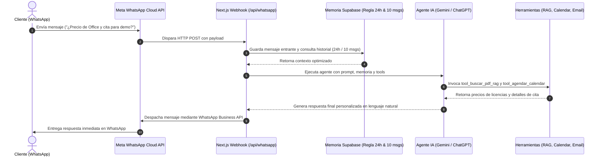

# ValisChat — CRM Inteligente de WhatsApp Business & Agente de Ventas con IA

**ValisChat** es el submódulo de mensajería, atención al cliente y ventas automatizadas del ecosistema **ValisHub**. Está diseñado para conectar cuentas oficiales de **WhatsApp Business (Meta Cloud API)** con un **Agente de Inteligencia Artificial multi-modelo**, operando como un CRM omnicanal moderno en tiempo real con capacidades de *Function Calling* (llamada a herramientas), gestión eficiente de memoria y control humano instantáneo.

---

## 1. ¿Qué es y qué hace ValisChat?

ValisChat transforma una línea de WhatsApp Business en un centro de operaciones comerciales 24/7. Permite gestionar conversaciones con clientes, consultar catálogos y finanzas en tiempo real, agendar citas y cerrar ventas automáticamente o asistido por humanos.

### Funcionalidades Principales:
- **Bandeja de Entrada Multidispositivo (Estilo WhatsApp Web):**
  - Vista unificada con lista de chats, fotos de perfil, insignias de mensajes no leídos y marcas de tiempo.
  - Burbujas de chat interactivas con estados de entrega: enviado, entregado y leído (*ticks* azules).
  - Experiencia optimizada para móviles (iOS/Android sin zoom molesto de Safari y con scroll inteligente que respeta el teclado).
- **Sincronización en Vivo (Zero-Reload):**
  - Los mensajes entrantes y salientes se actualizan en pantalla al instante mediante **Supabase Realtime (WebSockets)**, respaldado por un *heartbeat* de 3 segundos y auto-sincronización al desbloquear el teléfono o cambiar de pestaña.
- **Modos de Operación Flexibles:**
  - **Modo Autónomo (Auto 24/7):** El agente de IA responde automáticamente a los clientes en cuestión de segundos aplicando contexto de negocio y herramientas.
  - **Modo Copiloto (Asistencia Humana):** El agente no responde solo; en su lugar, el operador cuenta con los botones **"Sugerir con IA"** y **"Responder con IA"** para redactar respuestas contextuales antes de enviarlas.
- **Control de Intervención Humana:**
  - **Pausa Global del Bot:** Permite apagar o encender el bot en toda la plataforma con un solo clic en la barra superior.
  - **Pausa por Conversación:** Si un asesor humano entra a atender a un cliente específico, puede pausar el bot exclusivamente en ese chat para evitar respuestas cruzadas.
- **Gestión Inteligente de Memoria (Optimización de Tokens):**
  - **Regla de Inactividad de 24h:** Si el último mensaje del cliente fue hace más de 24 horas, el historial se descarta y se inicia una sesión limpia en blanco, reduciendo costos de tokens y evitando alucinaciones.
  - **Ventana Deslizante (Sliding Window):** Extrae estrictamente los últimos 10 mensajes intercambiados para darle memoria conversacional al modelo sin sobrecargar el contexto.

---

## 2. ¿Cómo está construido? (Arquitectura Técnica)

ValisChat está construido con una arquitectura desacoplada, orientada a eventos y completamente tipada en **TypeScript**:

```
valisfin/
├── app/
│   ├── whatsapp/
│   │   ├── page.tsx                    # Página Server Component (SSR de chats y mensajes)
│   │   └── WhatsAppChatClient.tsx      # Cliente interactivo (WebSockets, UI, eventos táctiles)
│   ├── agente/                         # Panel de configuración del Agente IA (prompt, modelo, modo)
│   ├── conectores/                     # Panel de gestión de credenciales y estados de APIs
│   ├── actions/
│   │   ├── whatsapp.ts                 # Server Actions para envío de mensajes y cambio de estados
│   │   └── valischat_agent.ts          # Server Actions para copiloto y pruebas en sandbox
│   └── api/whatsapp/
│       ├── route.ts                    # Endpoint universal del webhook (/api/whatsapp)
│       └── webhook/route.ts            # Webhook activo para Meta WhatsApp Cloud API
└── lib/
    └── valischat/
        ├── memory.ts                   # Lógica de memoria Supabase (24h + 10 mensajes)
        ├── tools.ts                    # Definición universal de herramientas (Function Calling)
        └── agent.ts                    # Orquestador Multi-Proveedor (Gemini / OpenAI / ChatGPT)
```

### Tecnologías Utilizadas:
- **Next.js 16 (App Router & Turbopack):** Manejo de rutas, Server Actions y API Routes de alta velocidad.
- **Supabase (PostgreSQL & Realtime):**
  - Tabla `whatsapp_chats`: Directorio de conversaciones, nombres, teléfonos y estado del bot.
  - Tabla `whatsapp_messages`: Registro cronológico de mensajes entrantes y salientes con UUIDs de Meta.
  - Tabla `valischat_agent_config`: Configuración del agente (proveedor, modelo, temperatura, system prompt).
- **Vercel Cloud:** Despliegue en arquitectura Serverless perimetral (Edge & Node.js).
- **Meta Graph API (v22.0):** API oficial de WhatsApp Cloud para recepción de webhooks y despacho de mensajes salientes.

---

## 3. El Motor de IA: Cerebro Agnóstico & Function Calling

A diferencia de los bots rígidos basados en árboles de decisión o diagramas de flujo, ValisChat utiliza un **Cerebro Inteligente Intercambiable** con arquitectura de **Llamada a Herramientas (*Function Calling*)**.

### Modelos Soportados:
| Proveedor | Modelos Compatibles | Tipo de Uso Recomendado |
| :--- | :--- | :--- |
| **Google Gemini** | `gemini-2.5-flash`, `gemini-1.5-flash`, `gemini-3.5-flash-lite`, `gemini-1.5-pro` | Ultra-rápido, económico, ideal para WhatsApp en tiempo real. |
| **OpenAI (ChatGPT)**| `gpt-4o-mini`, `gpt-4o`, `gpt-3.5-turbo` | Razonamiento avanzado, alta precisión en instrucciones complejas. |
| **Cualquier LLM Compatible** | Modelos locales o endpoints compatibles con la API de OpenAI / Gemini | Flexibilidad total de tokens. |

### Herramientas Nativas del Agente (`lib/valischat/tools.ts`):

El agente analiza la intención del mensaje del cliente y puede invocar dinámicamente:
1. **`tool_buscar_pdf_rag` (Recuperación Aumentada por Generación):**
   - **Qué hace:** Consulta bases documentales, manuales de usuario de ValisFin/ValisVen, catálogo de licencias de software (Office 365, sistemas POS) y políticas de soporte.
   - **Cuándo se activa:** Si el usuario pregunta precios, especificaciones técnicas, compatibilidad o manuales.
2. **`tool_agendar_calendar` (Gestión de Citas):**
   - **Qué hace:** Estructura citas comerciales con fecha, hora, cliente y motivo, devolviendo un enlace generado para Google Calendar.
   - **Cuándo se activa:** Si el cliente solicita una reunión, llamada o demostración del sistema.
3. **`tool_enviar_email` (Cierre Comercial):**
   - **Qué hace:** Notifica de inmediato al equipo de ventas con prioridad alta sobre un lead que está listo para comprar.
   - **Cuándo se activa:** Si el cliente confirma que desea comprar, pide cotización formal o solicita hablar con un asesor para pago.

---

## 4. Detalles de Conexiones e Integraciones

### 🟢 Conexiones Activas Actualmente:

1. **Meta WhatsApp Cloud API:**
   - **Identificador de Teléfono:** `WHATSAPP_PHONE_NUMBER_ID`
   - **Token de Acceso Permanente:** `WHATSAPP_ACCESS_TOKEN` (System User Token de Meta Business Manager)
   - **Webhook Verify Token:** `WHATSAPP_VERIFY_TOKEN`
   - **Capacidad:** Recepción de mensajes en vivo, confirmación de entrega (*sent*, *delivered*, *read*) y envío de texto e imágenes.

2. **Supabase (Base de Datos & Streaming):**
   - Conexión vía cliente `Service Role` para webhooks sin sesión de usuario.
   - Políticas RLS públicas para streaming WebSockets en clientes móviles y de escritorio.
   - Tablas conectadas para consulta contextual del agente: `incomes`, `daily_expenses`, `fixed_payments`, `valisven_clientes`, `valisven_licencias`.

3. **Google Gemini API:**
   - Llave `GEMINI_API_KEY`.
   - Soporte de Function Calling nativo con declaraciones de funciones tipadas y ejecución en dos turnos (*tool execution loop*).

4. **OpenAI API:**
   - Llave `OPENAI_API_KEY`.
   - Soporte nativo de `tools` y `tool_calls` para ChatGPT.

---

### 🔌 Conexiones Disponibles y Fáciles de Conectar:

El submódulo ya cuenta con la infraestructura lista para habilitar las siguientes conexiones:

1. **Google Calendar API:**
   - **Propósito:** Sincronización bidireccional directa para insertar la reunión en el calendario del equipo comercial y enviar invitación por correo al cliente.
   - **Requisito:** Cuenta de servicio de Google Cloud o credenciales OAuth en el panel `/conectores`.

2. **Gmail / Resend / SendGrid (Emailing Automático):**
   - **Propósito:** Despacho real de correos al equipo comercial cuando `tool_enviar_email` se ejecute, o envío de facturas/comprobantes al cliente.
   - **Requisito:** `RESEND_API_KEY` o credenciales SMTP de Gmail en `.env.local`.

3. **Pinecone / Supabase pgvector (RAG de Gran Escala):**
   - **Propósito:** Búsqueda vectorial sobre miles de páginas de PDFs o documentos institucionales.
   - **Requisito:** `PINECONE_API_KEY` y nombre del índice en el panel `/conectores` o activar la extensión `vector` en Supabase.

4. **Telegram Bot API:**
   - **Propósito:** Extender el mismo agente inteligente de ValisChat a un bot oficial de Telegram sin cambiar la lógica del cerebro.
   - **Requisito:** `TELEGRAM_BOT_TOKEN` (ya configurado en `/api/telegram`).

5. **Pasarelas de Pago (Yappy Comercial, PagueloFacil o Stripe):**
   - **Propósito:** Generar enlaces de pago dinámicos desde WhatsApp para cobrar licencias o servicios directamente en la conversación.

6. **Google Sheets / CRM Externo (HubSpot, Zoho):**
   - **Propósito:** Exportación automática de cada lead o cliente calificado por el bot hacia hojas de cálculo de ventas.

---

## 5. Variables de Entorno Requeridas (`.env.local`)

```env
# Supabase
NEXT_PUBLIC_SUPABASE_URL="https://tu-proyecto.supabase.co"
NEXT_PUBLIC_SUPABASE_ANON_KEY="tu-anon-key"
SUPABASE_SERVICE_ROLE_KEY="tu-service-role-key"

# Meta WhatsApp Cloud API
WHATSAPP_PHONE_NUMBER_ID="1337365866128316"
WHATSAPP_VERIFY_TOKEN="valishub_seguro_2026"
WHATSAPP_ACCESS_TOKEN="EAG..."

# Cerebros de Inteligencia Artificial (Elige uno o ambos)
GEMINI_API_KEY="AQ.Ab8..."
OPENAI_API_KEY="sk-proj-..."

# Notificaciones y Conectores Opcionales
COMMERCIAL_EMAIL="ventas@valisfin.com"
```

---

## 6. Resumen de Flujo de Operación



---

*ValisChat — Desarrollado con tecnología de punta para el ecosistema unificado ValisHub.*